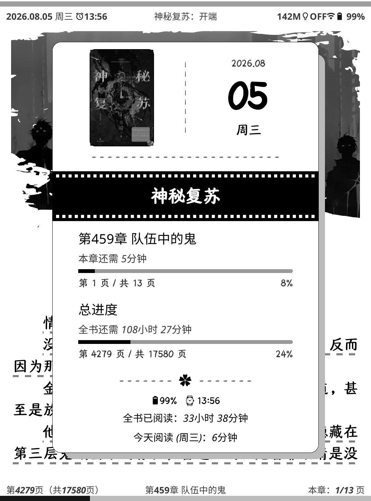

# 📖 KOReader 阅读小票 + 锁屏壁纸补丁

> **KOReader patch — book receipt & sleep-screen wallpapers.** Four switchable styles
> (reading ticket / ink stain / order slip / random image) sharing one pool, shown either on a
> gesture or as the sleep screen, in alternate or random order. Chinese UI; drop-in single `.lua`.

[](LICENSE)
-green.svg)

把 KOReader 的每次休眠、每个手势，都变成一张好看的阅读小票或壁纸：**四种样式同池使用，轮流或随机显示，数据全部来自本地阅读统计，不写盘、无网络、无第三方服务。**

---

## ✨ 四种样式

| 样式 | 说明 | 依赖当前书籍 |
| --- | --- | --- |
| 🎞️ **阅读日票**（`film`） | 仿电影票根：贝塞尔圆角 + 锯齿 + 撕口 + 伪条码/伪二维码，票面内是当前书籍封面、页码、进度、全书/本章剩余时间、今日阅读时长，右下为**只读星级**（取自书籍摘要的评分） | ✅ 需要 |
| 🖋️ **墨痕壁纸**（`inkstain`） | 墨痕账单式统计卡片：周期内阅读总时长、日均时长、每日趋势折线图、Top N 书单；底部三行诗词（诗句 / 朝代·作者 / 作品名），每次轮换 | ❌ 不需要 |
| 📋 **菜单留单台**（`menu`） | 餐厅留台单风格：随机 5 道菜（主菜×2、汤菜、饮品、甜点）+ 单价合计；右下角名人名言三行 | ❌ 不需要 |
| 🖼️ **随机图片**（`image`） | 整屏显示 KOReader 默认图片文件夹里的一张随机图片 —— 即 KOReader 原生「随机图片」屏保的效果 | ❌ 不需要 |

四种样式各带勾选框：**勾选＝纳入显示池**；`摘要显示模式` 选「轮流显示」按
`阅读日票 → 墨痕壁纸 → 菜单留单台 → 随机图片` 顺序循环，选「随机显示」则每次从池中随机抽取。
只勾一种即为固定样式（默认只勾「阅读日票」）。

## 📸 预览

| 阅读日票 | 墨痕壁纸 | 菜单留单台 |
| :---: | :---: | :---: |
|  |  |  |

> 截图可能来自较早版本（相机拍屏，效果受设备面板影响）。欢迎 PR 更新截图。

## 🚀 安装

1. 下载本仓库的 [`2-book-receipt-shortcut-and-lockscreen.lua`](2-book-receipt-shortcut-and-lockscreen.lua)；
2. 放进 KOReader 的 `patches/` 目录（没有就新建）。**文件名必须以数字开头**（KOReader 按数字顺序加载补丁，本补丁用 `2-`）；
3. 完全退出并重新打开 KOReader。

目录结构示例：

```
koreader/
├── patches/
│   └── 2-book-receipt-shortcut-and-lockscreen.lua
└── settings/
```

**可选依赖**：`inkstain.koplugin` 的字体与二维码资源（`huiwen_ming.otf`、`github_qr.png`）。
缺失时补丁自动降级（回退内置字体 / 伪二维码），不会报错。

## ⚙️ 使用

### 1. 锁屏（休眠屏保）

**设置 → 屏保 → 勾选「在休眠屏幕显示阅读摘要」**（`Show book receipt on sleep screen`）。
之后休眠时即按当前显示池 + 显示模式渲染。

### 2. 手势呼出

**设置 → 手势管理 → 阅读器**，给下面两个动作各分配一个手势：

| 动作名 | 行为 |
| --- | --- |
| `Book-RL：阅读摘要` | 按勾选池 + 摘要显示模式显示（轮流 / 随机） |
| `Book-RL：阅读日票` | **无视勾选池与显示模式**，恒显示阅读日票 |

弹窗点击空白处 / 轻扫即可关闭。

### 3. 设置项一览

**设置 → 屏保 → 阅读摘要设置**：

| 设置项 | 子项 | 说明 |
| --- | --- | --- |
| **阅读日票** | 锁屏背景 | `白色背景 / 透明 / 黑色背景 / 随机图片 / 书籍封面`（只作用于**锁屏**，手势弹窗是画在书页上的透明票面） |
| | 背景图片显示方式 | `适应屏幕 / 拉伸填满 / 居中不缩放`（与「随机图片」样式共用） |
| | 封面缩放 | 调整票面内封面大小，`0` = 隐藏封面 |
| **墨痕壁纸** | 统计周期 | `今天 / 最近 7 天 / 最近 30 天` |
| | 书单数量 | `Top 2 ~ 5` |
| **菜单留单台** | — | 与墨痕共用统计周期 / 书单数量，故只有勾选框 |
| **随机图片** | 背景图片显示方式 | 与阅读日票共用 |
| **摘要显示模式** | — | `轮流显示 / 随机显示` |
| **设备：…** | — | 墨痕/菜单的「设备」栏显示内容；**点这一栏可自定义输入**，留空保存即恢复自动读取（型号 + 分辨率 + DPI） |
| **唤醒合并重绘** | — | 见下方「常见问题」，**默认关闭** |

> 「背景=透明」在**锁屏**上会兜底为不透明底色（白；若 KOReader 的「边框填充」=黑色则用黑），
> 保证锁屏永远不会露出当前阅读页。

## 📊 数据来源

| 样式 | 数据 |
| --- | --- |
| 阅读日票 | 当前打开书籍的阅读状态（页码、章节、进度、`avg_time`、今日时长、`summary.rating` 星级） |
| 墨痕壁纸 / 菜单留单台 | KOReader 自带「阅读统计」数据库 `statistics.sqlite3` |
| 随机图片 | 屏保设置里的自定义图片文件夹（`screensaver_dir`） |

全部在内存中渲染，**渲染路径不写盘、无定时器、无网络**。

## ❓ 常见问题

**Q：休眠 / 唤醒时屏幕会闪（黑闪）？**
A：这是 **KOReader 自身**的刷新行为，不是本补丁产生的（挂起→唤醒之间补丁没有任何渲染）。唤醒时 KOReader 会先后发多次整屏 `full` 刷新（`ScreenSaverWidget:onCloseWidget`、`Kindle:outofScreenSaver` 的重绘），e-ink 上 `full` 波形＝一次黑闪；插件在 resume 时的重排版还会再补几次。
打开 **阅读摘要设置 → 唤醒合并重绘** 即可在唤醒期把这些请求全部吞掉、安静下来后只重绘一次（默认关闭，即完全保留 KOReader 原行为）；打开后 `crash.log` 会有一行
`[BookReceipt] 唤醒合并：吞掉 N 次刷新请求，统一重绘 1 次`。
另可检查 `屏保 → 延迟屏幕更新`：设为「Never/关闭」时 KOReader 会多一次整屏重绘。

**Q：锁屏背景选了「随机图片」却是黑/白底？**
A：检查 `背景图片显示方式`。`居中（不缩放）` 会把图片按原始像素画在正中，而票面正好盖住中间——图片小于屏幕时会被完全遮住，只剩填充色（补丁已自动兜底：不合适时改用「适应屏幕」，并在 `crash.log` 记一行）；直接选「适应屏幕」或「拉伸填满」最直观。

**Q：墨痕/菜单显示空白或提示文字？**
A：确认 KOReader 的「阅读统计」已启用且库非空；数据库为空时补丁会显示友好提示而不是报错。

**Q：菜谱 / 名言 / 诗词能改吗？**
A：语料内嵌在补丁里（诗词 200 / 菜谱 250 / 名言 200），首次使用时解析。可自行修改文件中的 `POEM_TEXT` / `RECIPE_TEXT` / `QUOTATION_TEXT`。

**Q：影响性能或耗电吗？**
A：不会。渲染只在显示时进行，无后台任务；语料解析已惰性化（不阻塞启动）。

## 🧪 开发与测试

补丁自带一份沙箱单测（用 [fengari](https://github.com/fengari-lua/fengari) 在 Node 里跑真实源码），覆盖样式池 / 迁移 / 轮换、日票渲染冒烟、手势动作注册、菜单注入、锁屏底色兜底、唤醒合并、设备栏自定义、内容库解析等：

```bash
npm i fengari
node spec/test_style_pool.js
```

```
READ RECEIPT RENDER SMOKE PASSED (4137 paintRect)
GESTURE ACTIONS PASSED (Book-RL：阅读摘要 / Book-RL：阅读日票)
SCREENSAVER BACKGROUND FALLBACK PASSED
LAZY CONTENT LIBRARY PASSED (200 诗词 / 250 菜谱 / 200 名言)
WAKE-UP COALESCE (opt-in) PASSED
DEVICE ROW CUSTOM TEXT PASSED
CENTERED BACKGROUND FALLBACK PASSED
MENU INJECTION PASSED (…; film: 锁屏背景 | 封面缩放)
WAKE REFRESH COUNTER PASSED (n=4（…）)
STYLE POOL TESTS PASSED
```

开发环境：KOReader `v2026.07.2`，Kindle Basic 4（2022，1072×1448）。

## 🙏 致谢

- 墨痕壁纸引擎整合自 [inkstain.koplugin](https://github.com/Estela-Zelin84/inkstain.koplugin)（作者 Estela-Zelin84）；
- 感谢 KOReader 社区与其插件生态。

## 📄 许可证

**GNU General Public License v3.0**（GPL-3.0）—— 可自由使用、修改、分发，衍生物须同样以 GPL-3.0 开源。详见 [LICENSE](LICENSE)。

---

**Happy Reading! 📖**
